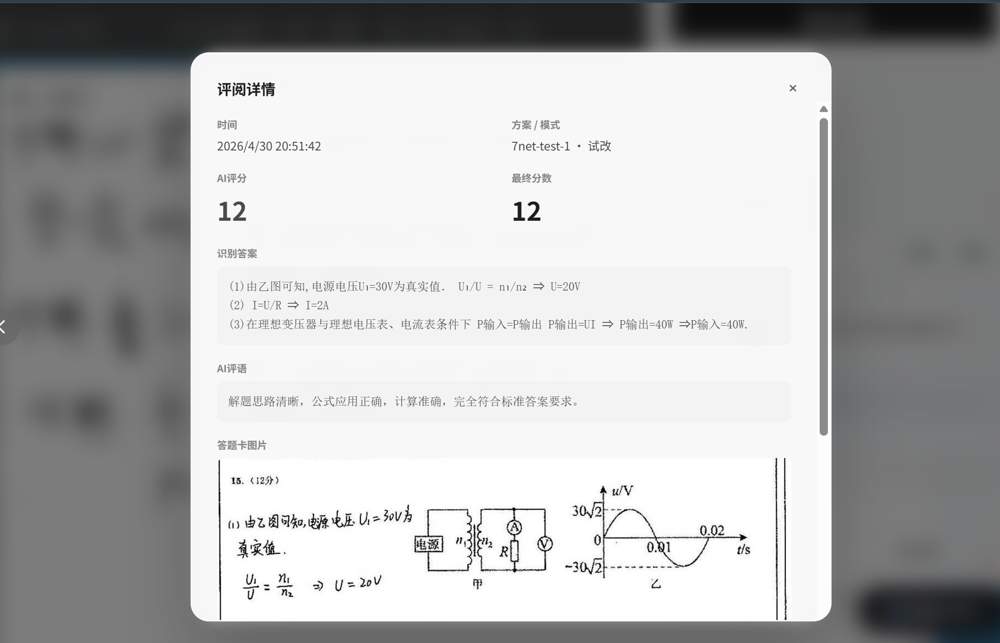

# AI-Marker-Suite — AI 批改助手

> **晚上挂机睡觉，早上起来全改完。**

---

## 为什么你需要它？

| 痛点 | AI 批改助手 |
|------|------------|
| 一份主观题看 2~3 分钟 | *AI 自动评分**，含分数 + 评语 |
| 改到半夜眼睛酸 | **无人值守模式**，挂机自动改，睡觉就行 |
| 评分标准难统一 | **自定义评分标准**，AI 按同一把尺子打分 |
| 每道题都要手动输分、点提交 | **全自动**：识别 → 打分 → 填入 → 提交 → 下一份 |
| 改完想回头看某份试卷 | **评阅历史**，一键回看，支持导出报告 |

**支持平台：智学网、七天网络、好分数、五岳阅卷、华翰云、光大阅卷**  如果您有适配需求，请联系我。

---

## 3 分钟上手

### 1. 安装浏览器插件

安装 **Tampermonkey（油猴）** 扩展 —— 一个免费的浏览器脚本管理器：

| 浏览器 | 安装地址 |
|--------|---------|
| Chrome | [Chrome 网上应用店](https://chrome.google.com/webstore/detail/tampermonkey/dhdgffkkebhmkfjojejmpbldmpobfkfo) |
| Edge | [Edge 外接程序商店](https://microsoftedge.microsoft.com/addons/detail/tampermonkey/iikmkjmpaadaobahmlepeloendndfphd) |
| Firefox | [Firefox 附加组件](https://addons.mozilla.org/zh-CN/firefox/addon/tampermonkey/) |

### 2. 一键安装脚本

> 确保已安装 Tampermonkey，点击下方链接，浏览器会自动弹出安装提示：

**[点击一键安装](https://auto-update.aimarking.five-plus-one.com/ota/ai_marker.user.js)**

### 3. 配置 API 密钥

1. 打开阅卷页面（智学网、七天网络或好分数）
2. 页面右上角出现 **AI 打分配置** 面板
3. 点击 **获取 API KEY** 免费注册（推荐使用 5+1 AI）
4. 填入密钥，点击 **保存并启用**

### 4. 开始批改

打开任意一份学生答题卡，点击右下角 **开始 AI 打分**，完事。

---

## 核心功能

### 智能评分
- AI 自动识别手写答案，根据你设定的评分标准打分
- 生成评语和得分理由，可实时查看 AI 思考过程
- **分小题评分**：一道大题拆成多个小题分别打分（如作文分内容/语言/结构）

### 三种模式，按需选择

| | 普通模式 | 试改模式 | 无人值守模式 |
|--|---------|---------|------------|
| 适合场景 | 日常少量批改 | 首次使用、调优评分标准 | 大量试卷、夜间挂机 |
| 提交速度 | 5 秒倒计时（可暂停/取消） | 等待教师确认 | 1 秒自动提交 |
| 错误处理 | 弹窗提示 | 弹窗提示 | 自动重试，最多 3 次 |
| 纠错支持 | 支持 | 支持 | 不支持 |

### 多方案管理
- 不同题目（语文作文 / 数学大题 / 英语翻译）保存不同配置
- 绑定题目 URL，打开自动切换，不用每次手动选

### 分数纠错
- AI 打分不准？输入正确分数，AI 自动分析原因
- 自动优化评分标准，越用越准

### 评阅历史
- 独立浮动按钮，随时查看批改记录
- 支持导出 HTML 报告（含答题卡图片），方便存档

### 多服务商
- 内置 5+1 AI 推荐服务（免费注册）
- 也支持 DeepSeek、火山引擎、硅基流动等任何 OpenAI 兼容接口

---

## 常见问题

**Q: 识别不准怎么办？**
填写「题目内容」「标准答案」「评分标准」三项，准确率会大幅提升。

**Q: 遇到 403 错误？**
脚本自动检测并刷新页面，无需手动处理。

**Q: 无人值守安全吗？**
建议先用普通模式批改几份，确认 AI 评分准确后再开无人值守。

**Q: 支持哪些题型？**
所有有手写答案的主观题（作文、解答题、论述题等）。客观题用平台自带功能即可。

**Q: 怎么停止批改？**
点右下角按钮暂停，在弹窗中点「取消并退出」。

**Q: 弹窗没出现？**
按 `F12` 打开控制台，查看带 `[诊断]` 标记的日志，截图反馈给作者。

---

## API 服务

### 推荐：5+1 AI
- 免费注册：[获取 API KEY](https://api.ai.five-plus-one.com/console/token)
- 端点：`https://api.ai.five-plus-one.com/v1/chat/completions`
- 默认模型：`mimo-v2.5`

### 其他服务
支持任何 OpenAI 兼容接口（DeepSeek、火山引擎、硅基流动等），自行填写端点、密钥和模型名即可。

---

## 反馈与支持

- **问题反馈**：[GitHub Issues](https://github.com/five-plus-one/AI-Marker-Suite/issues)
- **联系方式**：[https://r-l.ink/contact](https://r-l.ink/contact)
- **请作者喝咖啡**：[支持页面](http://r-l.ink/support)

> 如果你愿意提供测试账号（智学网/七天网络/好分数/或其他您希望支持的平台），请联系作者，非常感谢！

---

## 更新日志

### v1.21.3 (2026-05-13)
**新功能**
- 新增批阅份数功能：支持设置目标批阅份数，达到后自动暂停，可选择继续、停止或重置
- 新增工具页面 (/tools)：集中查看历史记录、关于信息、检查更新，无需进入阅卷页面
- 历史记录导出重构：统一导出栏，支持 JSON/CSV/HTML 格式切换，HTML 支持有图/无图导出
- 图片缓存跨域可见：在任意阅卷平台均可查看图片缓存大小
- 图片三态标注：有图可导出、有图·无法导出、无图
- 阅卷平台非阅卷页面注入历史按钮
- 历史面板新增分页功能
- 油猴菜单拆分为「工具栏」和「历史记录」两个快捷入口

**优化**
- 图片筛选功能联动：仅在 HTML 有图模式下显示图片状态筛选
- getImageStatus 性能优化：添加内存缓存，解决大量记录时筛选卡死
- UI 风格统一：格式选择器、图片选项、导出按钮样式一致
- 分小题分数应用取整规则：与总分取整逻辑保持一致
- 双评模式小题分数取平均：两个模型的小题分数分别取平均后填入

**修复**
- iframe 内重复注入：添加 @noframes 指令和 frame 检测
- 选中按钮文字不变白：修复 CSS 优先级问题
- 无人值守模式下无法手动检查更新
- SPA 导航后工具页面不注入
- 历史面板深色模式字体颜色问题
- 无人值守模式暂停后自动刷新

### v1.21.2 (2026-05-09)
**新功能**
- 新增工作流配置系统：内置快速批改/普通批改/双评模式三种工作流，支持用户自建、编辑、删除工作流
- 新增双评仲裁模式：两个 AI 模型独立评分，分差超阈值自动触发第三模型仲裁
- 新增思考链深度设置：支持 minimal/low/medium/high 四档推理深度，适配不同模型
- 新增用户引导：首次使用时分步引导配置 API 密钥、方案名称、批改模式和工作流
- 新增华翰云 (yunyuejuan.net) 阅卷平台适配
- 新增多供应商管理：支持 5plus1官方、火山引擎、OpenAI 兼容等多种 API 服务商

**优化**
- 双评模式面板重构：结果→老师A独立区块→老师B独立区块→仲裁结果，提交弹窗/历史详情/HTML导出三处同步
- CSV 导出新增老师A/B评分依据、分数计算、仲裁分析等详细列
- 编辑默认工作流时弹出确认对话框，用户工作流无需确认
- 弹出编辑窗口时点击空白区域不再自动关闭
- 工作流管理新增删除按钮：仅用户自建工作流可删除

**修复**
- 修复编辑工作流后刷新不生效
- 修复新建工作流时模型下拉为空
- 修复纠错面板"提示词优化"报错 endpoint undefined
- 修复删除模型报错 deleteModel is not defined

### v1.12.1 (2026-05-08)
- 新增五岳阅卷 (wylkyj.com) 平台适配，支持答题卡识别和分小题评分
- 轻量级更新检查：优先检查 manifest.json (~1KB)，失败时降级检查完整脚本
- Changelog 统一管理：文档站和脚本从远端 manifest.json 加载
- 更新后刷新优化：等待时间从 15 秒缩短到 10 秒，新增「立即刷新」按钮
- 开源协议从 MIT 更改为 GPL-3.0

### v1.12.0 (2026-05-07)
- 新增好分数 (haofenshu.com) 平台适配，支持 SVG 答题卡识别和 Vue 输入框分数填充
- 侧边栏配置页重构为分组结构：基本、批改、AI 配置、其他
- 关于页新增完整 CHANGELOG 展示
- 通信密钥未填写时显示醒目红色警告横幅和分组标题提示
- 新增「保存答题卡图片」开关，可关闭图片缓存以节省存储空间

### v1.11.2 (2026-05-02)
- 修复纠错面板"提示词优化"不显示优化结果的问题：AI 输出含 markdown 加粗标记导致正则匹配失败，解析器已增强容错
- 修复解析器将"不变"后的括号注释误认为评分标准内容的问题
- 优化分析提示词：明确要求 AI 将发现的问题写入对应字段，而非简单回复"不变"
- 修复所有弹窗/通知的 z-index 层级：Toast、更新提示、确认弹窗现在均能正确显示在历史面板之上
- 智学网单题模式下自动跳过分小题给分，仅在检测到 2 个及以上小题时启用

### v1.11.1 (2026-05-02)
- 智学网分小题给分适配：自动识别 `#containter_topicTxt` 中的多个小题输入框并逐题填入分数
- 修复 64MiB 存储溢出：`imageUrls` 中的 base64 data URL 被完整存入 GM_setValue，现在所有写入路径均自动剥离
- 历史记录存储增加主动防御：超过 50MB 安全线时自动清理最旧记录，GM_setValue 写入失败时渐进截断恢复
- 每次保存后在控制台输出当前存储大小，便于监控膨胀趋势
- 纠错面板支持分小题独立修正，各小题分数可单独调整
- 移除历史记录 500 条硬上限，改为纯存储空间驱动的防御性清理
- 历史面板新增存储状态栏：实时显示记录数、数据库大小、图片缓存大小
- 历史面板新增清理选项：清理图片缓存、清理30天前记录、清空全部

### v1.11.0 (2026-05-02)
- 全面 UI 重构：设置面板改为右侧滑入式侧边栏
- 浮动按钮增加脉冲动画状态指示，历史按钮改为 SVG 图标
- Toast 通知支持成功/错误/信息状态，可手动关闭
- 模态弹窗动画优化（scale + translate）
- 流输出面板新增复制按钮
- 提交对话框分数改为环形展示，倒计时改为环形进度
- 纠错面板新增步骤进度指示器
- 历史详情改为右侧抽屉式滑入，筛选改为可折叠面板

### v1.10.4 (2026-05-01)
- 修复配置导入功能中错误的函数名引用（showConfirmDialog、refreshPresetSelect）

### v1.10.3 (2026-05-01)
- 修复配置导入功能报错 showConfirmDialog is not defined

### v1.10.2 (2026-05-01)
- 修复历史记录面板清空确认弹窗被遮挡的 z-index 层级问题
- 修复更新检查时 changelog 不显示的问题（从远端脚本提取 CHANGELOG）
- 修复历史记录弹窗动画开始时位置不居中的问题
- 更新后自动刷新页面，无需手动重载
- 检查更新按钮增加加载动画
- 新增配置导出/导入功能，支持 JSON 文件备份和恢复

### v1.10.0 (2026-05-01)
- 新增分小题评分适配：七天网络新UI和旧版支持分小题独立给分
- `detectSubQuestions()` 纳入标准适配器协议，平台自动检测小题列表
- 设置面板自动识别平台小题，无需手动配置分小题信息
- 历史记录图片存储改为 IndexedDB，修复长时间批改后脚本崩溃（64MiB 限制）
- 旧记录图片数据自动迁移到 IndexedDB，升级无感

### v1.9.0 (2026-04-30)
- 新增七天网络新 UI (yj5.7net.cc) 适配，支持 Vue SPA + Canvas 渲染答题卡
- 通过 XMLHttpRequest 拦截 API 响应精确获取当前学生图片，解决预取图片干扰问题
- 新增试改模式，每次批改后暂停等待教师确认，支持分数纠错和提示词优化
- AI 失败自动重试时复用已下载图片，避免重复抓取
- 构建输出自动压缩 (terser)，文件体积减少约 30%
- 修复七天网络新 UI 提交按钮选择器错误
- 修复连续批改时图片错位问题

### v1.8.5 (2026-04-30)
- 新增七天网络阅卷平台适配，一个脚本同时支持智学网和七天网络
- 统一构建输出，自动检测当前平台并加载对应适配器

### v1.8.3 (2026-04-30)
- 新增分小题评分功能，支持将大题拆分为多个小题分别评分
- 纠错流程精简为两步，确认后直接使用教师分数
- 新增独立浮动历史按钮和多服务商管理系统

### v1.8.0 (2026-04-20)
- 纠错面板重新设计，支持查看 AI 分析和手动修改提示词
- 新增评分模式切换（普通/无人值守）

### v1.7.0 (2026-04-10)
- 新增自动检查更新功能
- 代码结构重构为模块化

---

## 许可证

GNU General Public License v3.0 - 详见 [LICENSE](LICENSE)

---

## 免责声明

1. 本工具仅供学习交流使用
2. AI 评分结果仅供参考，教师应审核确认后再提交
3. 使用本工具产生的任何后果由使用者自行承担
4. 请遵守阅卷平台的使用条款

---

**觉得有用？[给个 Star](https://github.com/five-plus-one/AI-Marker-Suite) 支持一下！**

Made by [5plus1](https://five-plus-one.com/)

